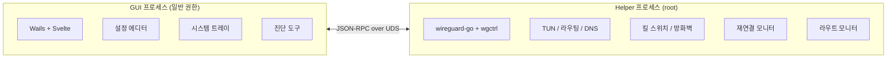

<p align="center">
  
</p>

<h1 align="center">WireGuide</h1>

<p align="center">
  킬 스위치와 자동 재연결을 지원하는 크로스 플랫폼 WireGuard VPN 클라이언트
</p>

<p align="center">
  <a href="https://github.com/steiale/wireguide/releases/latest"></a>
  <a href="https://github.com/steiale/wireguide/stargazers"></a>
  <a href="#설치"></a>
  
  <a href="LICENSE"></a>
</p>

<p align="center">
  <a href="README.md">English</a>
</p>

---

<table>
  <tr>
    <td align="center"><br><sub>VPN 연결됨</sub></td>
    <td align="center"><br><sub>설정 에디터</sub></td>
  </tr>
  <tr>
    <td align="center"><br><sub>자동완성</sub></td>
    <td align="center"><br><sub>네트워크 진단</sub></td>
  </tr>
</table>

---

## 기능

| 기능 | 설명 |
|------|------|
| **멀티 터널** | 여러 WireGuard 터널을 동시에 연결하고 터널별 독립 상태 관리 |
| **터널 관리** | `.conf` 파일 가져오기, 생성, 편집, 내보내기. 드래그 앤 드롭 지원. |
| **설정 에디터** | CodeMirror 6 기반 WireGuard 문법 강조 및 자동완성 |
| **시스템 트레이** | 연결 상태 뱃지, 1클릭 연결/해제 |
| **킬 스위치** | macOS `pf`로 VPN 외 모든 트래픽 차단 (선택) |
| **DNS 보호** | DNS 쿼리를 VPN 터널로만 강제 (선택) |
| **헬스 체크** | 핸드셰이크 상태 모니터링 및 자동 재연결 (선택) |
| **슬립/웨이크 복구** | NSWorkspace로 시스템 웨이크 감지 및 터널 복구 |
| **라우트 모니터** | 게이트웨이 변경 시 엔드포인트 바이패스 라우트 재적용 |
| **인터페이스 고정** | WiFi + 이더넷 동시 연결 시 지연 스파이크 방지 |
| **충돌 감지** | Tailscale 등 다른 WG 인터페이스와의 라우트 충돌 경고 |
| **진단 도구** | Ping 테스트, DNS 유출 검사, 라우트 테이블 시각화 |
| **자동 업데이트** | GitHub Releases 확인; `brew upgrade` 및 직접 설치 지원 |
| **속도 대시보드** | 실시간 RX/TX 그래프 |
| **다국어** | 영어, 한국어, 일본어 |
| **테마** | 다크 / 라이트 / 시스템 자동 |

[wireguard-go](https://git.zx2c4.com/wireguard-go) 2025년 5월 빌드 사용 (공식 앱 대비 57커밋 앞섬).

---

## 설치

### macOS (Homebrew) — 권장

```bash
brew tap steiale/tap
brew install --cask wireguide
```

### macOS (수동)

[Releases](https://github.com/steiale/wireguide/releases)에서 다운로드 후 `/Applications`으로 이동.

> macOS에서 "앱이 손상되었습니다" 경고가 뜨면: `xattr -cr /Applications/WireGuide.app`

### 소스에서 빌드

```bash
brew install go node
go install github.com/go-task/task/v3/cmd/task@latest
go install github.com/wailsapp/wails/v3/cmd/wails3@latest

task build
./bin/wireguide
```

---

## 아키텍처



- **단일 바이너리** — `wireguide`가 GUI 또는 helper로 동작 (`--helper` 플래그)
- **권한 분리** — GUI는 일반 권한; helper는 root로 실행
- **IPC** — Unix 소켓 (macOS/Linux) 또는 Named Pipe (Windows) 위 JSON-RPC

---

## 기술 스택

| 구성 요소 | 기술 |
|-----------|------|
| 언어 | Go 1.25+ |
| GUI | [Wails v3](https://wails.io) |
| 프론트엔드 | Svelte + Vite |
| WireGuard | [wireguard-go](https://git.zx2c4.com/wireguard-go) + [wgctrl-go](https://github.com/WireGuard/wgctrl-go) |
| 에디터 | [CodeMirror 6](https://codemirror.net/) |
| 방화벽 | macOS `pf` / Linux `nftables` / Windows `netsh advfirewall` |

---

## 기여

개발 환경 설정 및 가이드라인은 [CONTRIBUTING.md](CONTRIBUTING.md)를 참조하세요.

버그를 발견하셨나요? [이슈를 등록](https://github.com/steiale/wireguide/issues/new/choose)해 주세요.

---

## 후원

<a href="https://github.com/sponsors/steiale">
  
</a>

WireGuide가 유용하셨다면 후원으로 개발을 지원해 주세요.

---

## 라이선스

[MIT](LICENSE)
