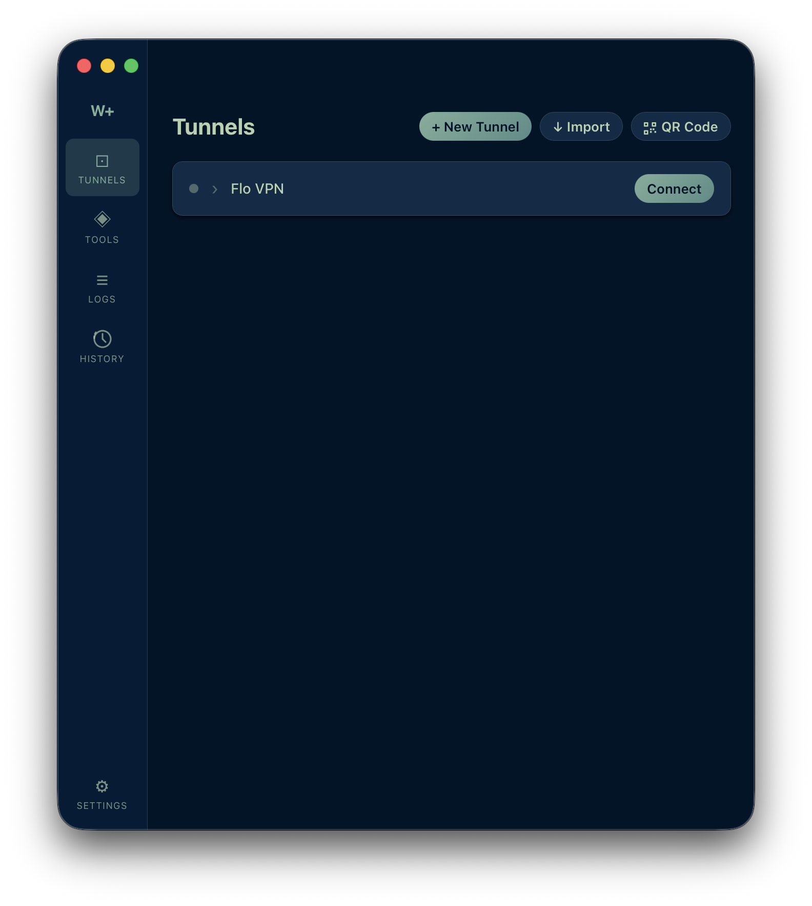
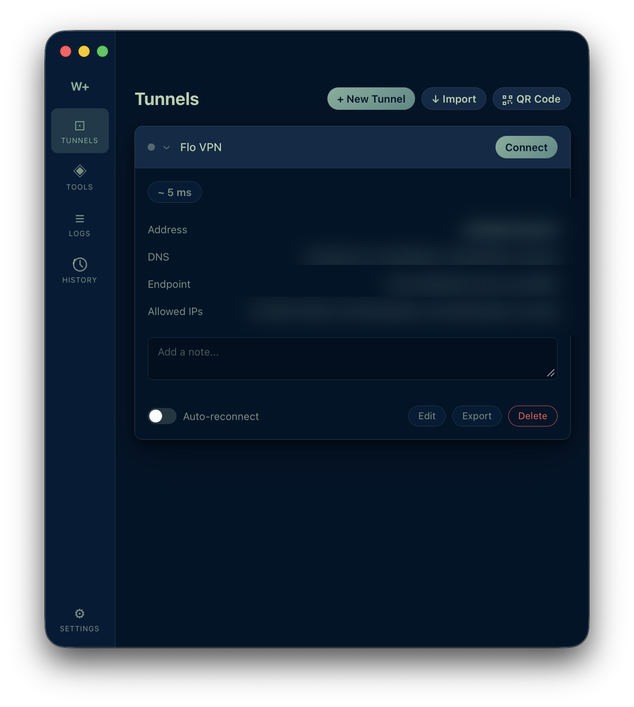
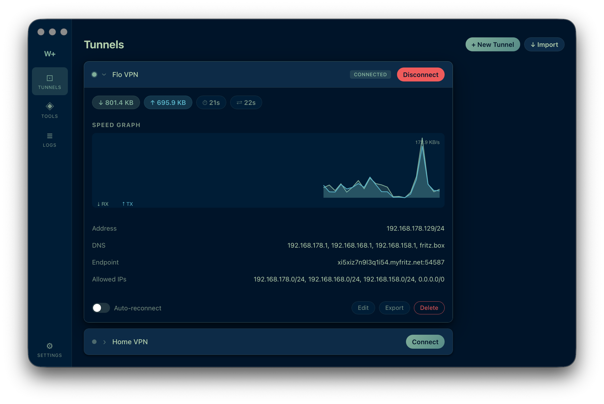
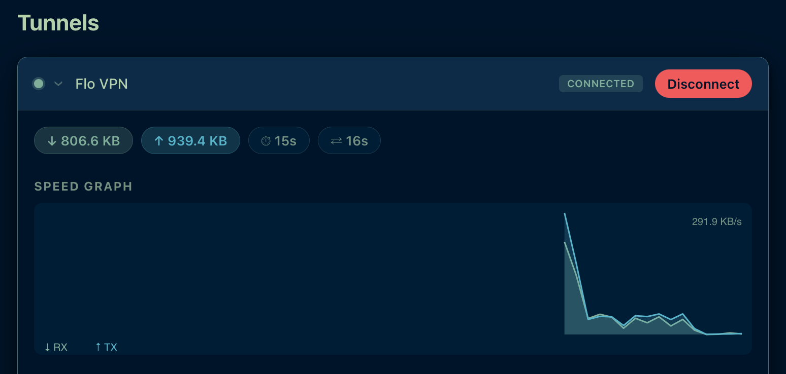
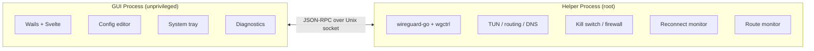

<p align="center">
  
</p>

<h1 align="center">WireGuide+</h1>

<p align="center">
  A macOS WireGuard VPN client with a clean card-based UI, kill switch, and auto-reconnect.<br>
  Signed, notarized, and distributed via Homebrew.
</p>

<p align="center">
  <a href="https://github.com/steiale/wireguide/releases/latest"></a>
  <a href="https://github.com/steiale/wireguide/stargazers"></a>
  <a href="#install"></a>
  
  <a href="LICENSE"></a>
  <a href="https://ko-fi.com/steiale"></a>
</p>

---

<table>
  <tr>
    <td align="center"><br><sub>Tunnel overview</sub></td>
    <td align="center"><br><sub>Expanded tunnel — config details</sub></td>
  </tr>
  <tr>
    <td align="center"><br><sub>Connected with live stats</sub></td>
    <td align="center"><br><sub>Real-time speed graph</sub></td>
  </tr>
</table>

---

## Features

| Feature | Description |
|---------|-------------|
| **Card-based UI** | Each tunnel is an expandable card — connect, view stats, edit, and manage in one place |
| **Live Speed Graph** | Real-time RX/TX bandwidth chart embedded in each tunnel card |
| **Multi-Tunnel** | Connect multiple WireGuard tunnels simultaneously with per-tunnel state |
| **Auto-Reconnect** | Per-tunnel reconnect on sleep/wake and network changes |
| **System Tray** | Connection status indicator, 1-click connect/disconnect from the menu bar |
| **Kill Switch** | Blocks all non-VPN traffic via macOS `pf` (optional) |
| **DNS Protection** | Forces DNS queries through the VPN tunnel only (optional) |
| **Config Editor** | Import, create, edit, export `.conf` files — drag-and-drop supported |
| **First-Run Wizard** | Automatically discovers existing WireGuard configs from the Mac App Store app |
| **Conflict Detection** | Warns about route conflicts with overlapping subnets |
| **Diagnostics** | Ping test, DNS leak test, route table visualization |
| **Auto-Update** | Checks GitHub Releases; supports `brew upgrade` |
| **Dark / Light / System** | Follows OS appearance with a navy/teal Jarvis-inspired theme |
| **Signed & Notarized** | Developer ID signed and Apple-notarized — no Gatekeeper warnings |

---

## Requirements

**Apple Silicon (M1 or later) only.** Intel Macs are not supported.

## Install

### Homebrew — recommended

```bash
brew tap steiale/tap
brew install --cask wireguide-plus
```

To update:

```bash
brew upgrade --cask wireguide-plus
```

### DMG — direct download

Download the latest `.dmg` from [Releases](https://github.com/steiale/wireguide/releases/latest), open it, and drag `WireGuide+.app` to `/Applications`. The app is signed and notarized — no Gatekeeper warnings.

### ZIP — manual

Download the latest `.zip` from [Releases](https://github.com/steiale/wireguide/releases/latest), unzip, and move `WireGuide+.app` to `/Applications`.

---

## Build from Source

```bash
brew install go node
go install github.com/go-task/task/v3/cmd/task@latest
go install github.com/wailsapp/wails/v3/cmd/wails3@latest

wails3 task darwin:package
open bin/wireguide-plus.app
```

---

## Architecture



- **Two binaries** — `wireguide-plus` (GUI, Wails/AppKit) and `wireguide-plus-helper` (daemon, IOKit only); the helper runs as a root LaunchDaemon without a window server
- **Privilege separation** — GUI is unprivileged; helper runs as root LaunchDaemon
- **IPC** — JSON-RPC over Unix domain socket

---

## Tech Stack

| Component | Technology |
|-----------|-----------|
| Language | Go 1.24+ |
| GUI | [Wails v3](https://wails.io) |
| Frontend | Svelte + Vite |
| WireGuard | [wireguard-go](https://git.zx2c4.com/wireguard-go) + [wgctrl-go](https://github.com/WireGuard/wgctrl-go) |
| Firewall | macOS `pf` |

---

## Fork

WireGuide+ is a fork of [WireGuide](https://github.com/korjwl1/wireguide) by korjwl1, extended with a redesigned UI, additional features, and macOS notarization.

---

## License

[MIT](LICENSE)
